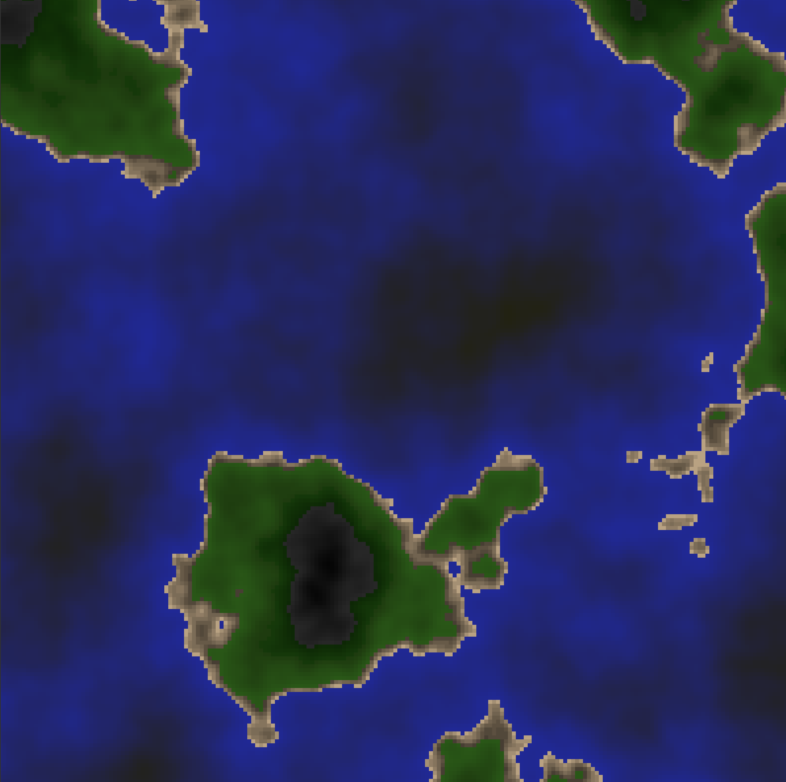

# Perlin Noise



## About

An implementation of the perlin noise algorithm to create procedurally generated islands. You are able to navigate the procedurarly generated world using the w a s d keys. This project is made purely in python and tkinter without the use of any external libraries.

## Installation & Setup

Follow these steps to set up and run the project:

1. **Clone the repository:**
   ```sh
   git clone https://github.com/Aleks-Tacconi/PerlinNoise.git
   ```
2. **Navigate to the project directory:**
   ```sh
   cd PerlinNoise
   ```
3. **Run the project:**
   ```sh
   python main.py
   ```
